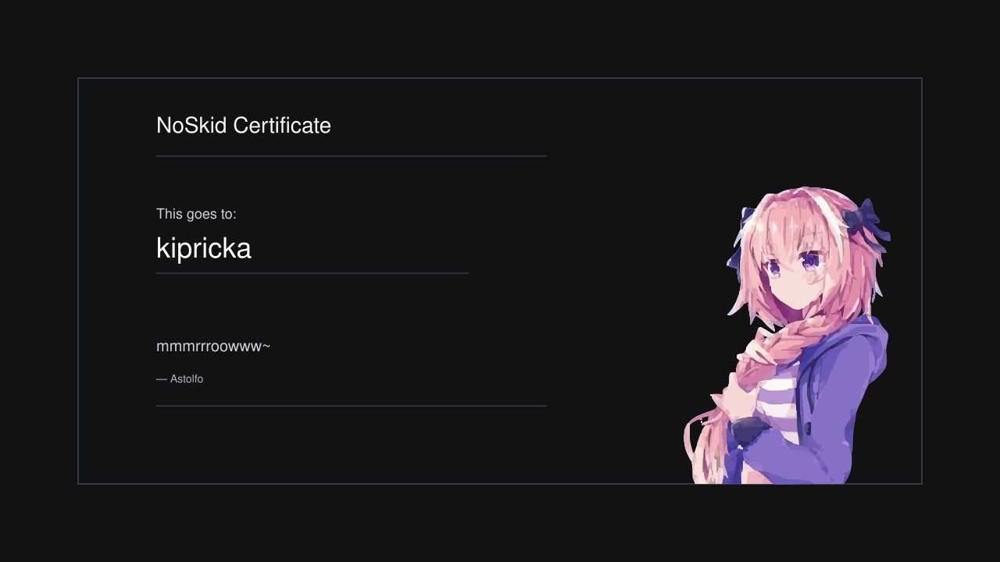

# Oh, hi !
<b>I'm `Kipricka`, also known as [`Douxx`](https://github.com/douxxtech)</b>

> As you could have guessed, this is a secondary account
---
Why ?
I'll use this account on my Fedora install, that is currently on an usb key with autologin, so i don't risk my main account if it gets stolen ;)

<h6>talking 'bout fedora...</h6>
<pre style="font-familly: monospace">
             .',;::::;,'.                douxx@fedokey 
         .';:cccccccccccc:;,.            ------------- 
      .;cccccccccccccccccccccc;.         OS: Fedora Linux 41 (Workstation Edition) x 
    .:cccccccccccccccccccccccccc:.       Host: LENOVO LNVNB161216 
  .;ccccccccccccc;.:dddl:.;ccccccc;.     Shell: bash 5.2.32 
 .:ccccccccccccc;OWMKOOXMWd;ccccccc:.    Resolution: 1920x1200 
.:ccccccccccccc;KMMc;cc;xMMc;ccccccc:.   WM: Hyprland 
,cccccccccccccc;MMM.;cc;;WW:;cccccccc,   CPU: 13th Gen Intel i5-13500H (16) @ 4.700G 
:cccccccccccccc;MMM.;cccccccccccccccc:   GPU: Intel Raptor Lake-P [Iris Xe Graphics] 
:ccccccc;oxOOOo;MMM0OOk.;cccccccccccc:   Memory: 4297MiB / 15719MiB 
cccccc;0MMKxdd:;MMMkddc.;cccccccccccc;   Disk (/): 13G / 232G (6%) 
ccccc;XM0';cccc;MMM.;cccccccccccccccc'   Battery0: 78% [Charging] 
ccccc;MMo;ccccc;MMW.;ccccccccccccccc;    Local IP: 192.168.1.140 
ccccc;0MNc.ccc.xMMd;ccccccccccccccc;     Users: douxx 
cccccc;dNMWXXXWM0:;cccccccccccccc:,      ------------ 
cccccccc;.:odl:.;cccccccccccccc:,.       Website: douxx.tech 
:cccccccccccccccccccccccccccc:'.
.:cccccccccccccccccccccc:;,..
  '::cccccccccccccc::;,.

[douxx@fedokey] ~ › 
</pre>
---
## Useless sh*t that nobody looks at

	 

